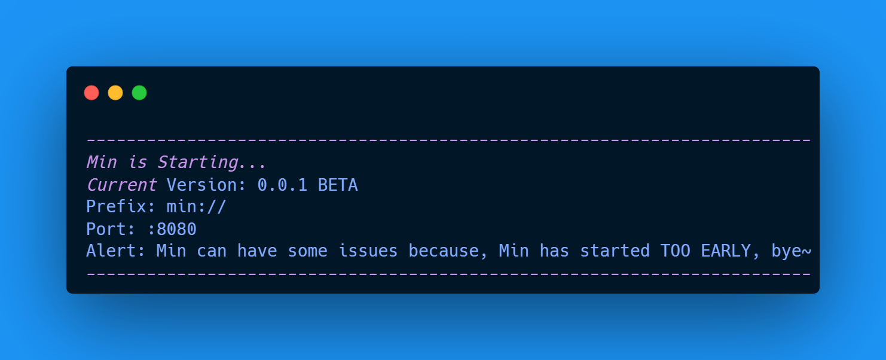

  

# Min
💫 An Simple Launcher written in go~

> **Note:** This Project is very, very early, he can have some bugs ;P

## About
I'm creating this because, i wanted to create a simple launcher, based on **Minecraft Launcher**, but for simple apps or games.

## Plugins
All Plugins are avaiable in [min.core/plugins](https://github.com/umastrodev12/Min/tree/main/min.core/plugins)

## Desktop Version

Min can run in Terminal, but also, Min has a Desktop Version called "Min Launcher Manager", you can see some things of Min and a bunch of other things.
